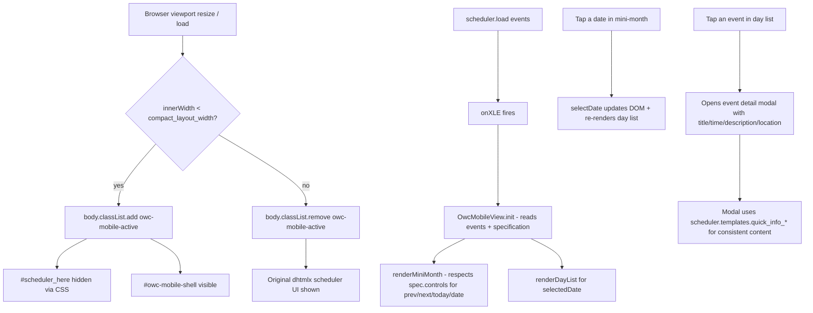

# Mobile Calendar Overhaul

> **Execution requirement:** Read and understand this entire plan before making any code changes. Any subagents listed in `## Execution: Subagent dispatch` below **must be executed** via `Task(...)` calls — do not substitute prose descriptions or skip subagent delegation steps.

## Architecture Overview



Key design points:

- The dhtmlx scheduler is **still initialized**. We rely on it for: ICS download, recurrence expansion, timezone conversion, locale, plugin behavior, quick_info template functions, and as the desktop fallback. On mobile we just don't show its DOM.
- The mobile shell is a **read-only UI layer** that consumes `scheduler.getEvents(start, end)`, `scheduler.locale`, and `scheduler.templates.quick_info_*` functions. It does not call any dhtmlx mutating APIs.
- **CSS theming consistency**: The mobile shell inherits colors from the same `specification['css']` that the desktop uses (rendered inline in `<style>` in dhtmlx.html). It uses the same dhtmlx CSS custom properties (`--dhx-scheduler-*`) for base colors. The theme extension's `generateCSS` color tokens (e.g. `/*start header_background*/ background-color: ...;/*end header_background*/`) are applied to mobile-view.css selectors too, so the Shopify theme editor color pickers work on both views.
- **Font consistency**: The theme extension's `calendar.js` injects fonts into the iframe via `applyShopifyFontToIframe()` targeting `.dhx_cal_navline *`, `.dhx_scale_bar`, etc. The mobile shell adds corresponding selectors (`.owc-mobile-month-header *` for header font, `.owc-mobile-day-list *` for body font) so the font injection also applies.
- **Controls parity**: `specification.controls` (prev/next/today/date) and `specification.tabs` are respected by the mobile header — same buttons shown/hidden as on desktop.
- **Event modal**: Tapping an event opens a modal overlay (`.owc-mobile-event-modal`) that shows event title, date/time, description, location, and categories — the exact same content produced by `scheduler.templates.quick_info_title`, `quick_info_content`, and `quick_info_date`. This replaces the previous plan's "open event.url in target" behavior.
- The breakpoint reuses `specification.compact_layout_width` (already documented; default 600).
- Class namespace `.owc-mobile-*` avoids overlap with `.dhx_*` selectors.

## Data Flow

1. Browser loads `/calendar.html?...`. Flask renders `templates/calendars/dhtmlx.html` with the spec injected as `var specification = {...}`.
2. The inline `<style>` block in the template renders `specification['css']` (which contains the generateCSS color tokens plus any user custom CSS). This style block affects BOTH the dhtmlx scheduler AND the mobile shell since both live in the same document.
3. Scripts load in this order: `dhtmlxscheduler.js` -> `mobile-view.js` (declares `window.OwcMobileView`) -> `configure.js` (defines `loadCalendar`, `getHeader`, `resetConfig`, scheduler templates including `quick_info_*`) -> `common.js` (utility helpers `getCalendarUrl`, `getSkin`, `getTimezone`).
4. `window.addEventListener("load", loadCalendar)` fires. Inside, `scheduler.init(...)` runs. Scheduler templates (including `quick_info_title`, `quick_info_content`, `quick_info_date`) are configured.
5. `scheduler.load(schedulerUrl, "json")` requests events.
6. `scheduler.attachEvent("onXLE", ...)` callback runs. First invocation calls `OwcMobileView.init(scheduler, specification)`, subsequent invocations call `OwcMobileView.refresh()`.
7. `OwcMobileView.init` reads `window.innerWidth`, computes the mobile flag, toggles `body.classList`, reads `specification.controls`/`specification.tabs` to configure which navigation buttons to render, and builds the shell into `#owc-mobile-shell`.
8. User interactions:
   - Date tap → updates `OwcMobileView.selectedDate`, re-renders day list, scrolls into view
   - Prev/next arrows → moves `OwcMobileView.viewMonth` ±1 (shown only if `specification.controls` includes "previous"/"next"), re-renders mini-month, calls `scheduler.setCurrentView(newDate, "month")` to keep scheduler in sync
   - Today button → navigates to today (shown only if `specification.controls` includes "today")
   - Event tap → opens the event detail modal. The modal content is built using `scheduler.templates.quick_info_title(start, end, event)`, `scheduler.templates.quick_info_content(start, end, event)`, and `scheduler.templates.quick_info_date(start, end, event)`. A close button (X) and a "link out" button (if `event.url` exists, opens in `specification.target`) are shown.
   - Modal close → hides modal overlay
9. The theme extension's `calendar.js` `iframe.onload` handler already (a) applies fonts to the iframe document via `applyShopifyFontToIframe()`, and (b) runs `generateCSS()` on the inline `<style>` element. Both of these naturally apply to the mobile shell since it lives in the same document. No changes needed in the theme extension.

## Files to Create

- **[open_web_calendar/static/css/dhtmlx/mobile-view.css](open_web_calendar/static/css/dhtmlx/mobile-view.css)** — Styles for the mobile shell. Includes:
  - `#owc-mobile-shell { display: none; }` by default; shown via `body.owc-mobile-active #owc-mobile-shell { display: flex; flex-direction: column; height: 100%; }`
  - `.owc-mobile-month-header` — flex row with prev/today/next + month label, min height 44px. Uses:
    - `/*start header_background*/ background-color: var(--dhx-scheduler-container-background);/*end header_background*/` for background
    - `/*start header_heading_text*/ color: var(--dhx-scheduler-container-color);/*end header_heading_text*/` for text
    - This ensures the theme extension's `generateCSS` color replacement works on these rules just as it does for `.dhx_cal_navline`
  - `.owc-mobile-month-grid` — 7-column CSS grid; each cell ≥ 44x44px, single-tap target
  - `.owc-mobile-day-cell` — date number + below it up to 3 colored dots (one per event, capped) and a "+N" badge if more. Uses:
    - `/*start date_grid_text*/ color: var(--dhx-scheduler-month-header-color);/*end date_grid_text*/` for number
    - `/*start date_grid_active_month_background*/ background-color: var(--dhx-scheduler-timescale-background);/*end date_grid_active_month_background*/` for cell background
    - `/*start event_dot*/ background-color: var(--dhx-scheduler-event-background);/*end event_dot*/` for dots
  - `.owc-mobile-day-cell.is-today` uses `/*start date_grid_today_background*/ background-color: var(--dhx-scheduler-timescale-today-background);/*end date_grid_today_background*/`
  - `.owc-mobile-day-cell.is-selected` — visible selection ring/highlight
  - `.owc-mobile-day-cell.is-other-month { opacity: 0.4; }`
  - `.owc-mobile-day-list` — vertical list, each row shows time + title + (optional) location, padding ≥ 12px for tap target. Uses:
    - `/*start event_text*/ color: inherit;/*end event_text*/` for event text
    - `/*start event_background*/ background-color: var(--dhx-scheduler-event-background);/*end event_background*/` for event row background
  - `.owc-mobile-event-modal` — Full-screen overlay (position: fixed, z-index: 200) with:
    - Semi-transparent backdrop
    - Centered card (max-width: 90%, max-height: 80vh, overflow-y: auto)
    - Uses same color tokens as quick info popup: `var(--dhx-scheduler-popup-background)`, `var(--dhx-scheduler-popup-color)`, `var(--dhx-scheduler-popup-border)`
    - `/*start modal_background*/ background-color: var(--dhx-scheduler-popup-background);/*end modal_background*/`
    - `/*start modal_text*/ color: var(--dhx-scheduler-popup-color);/*end modal_text*/`
    - Close button, title section, content section, link section
    - `/*start modal_links_text*/ color: var(--dhx-scheduler-base-colors-primary);/*end modal_links_text*/`
  - `.owc-mobile-empty-state` — centered text when no events on selected day
  - Font selectors for theme extension compatibility:
    - `.owc-mobile-month-header *, .owc-mobile-weekday-row *` — these match the header font pattern so `applyShopifyFontToIframe` can target them
    - `.owc-mobile-day-list *, .owc-mobile-event-modal *` — these match the body font pattern
  - All sizes in `rem`/`px` (no `vw` so we behave well inside narrow iframes)

- **[open_web_calendar/static/js/mobile-view.js](open_web_calendar/static/js/mobile-view.js)** — ES6 module-style script (loaded as plain script tag, not module — to match the existing pattern). Exposes:
  ```js
  window.OwcMobileView = {
    init(scheduler, specification) { ... },
    refresh() { ... },
    destroy() { ... },
  };
  ```
  Internal helpers:
  - `_isMobile(spec)` → boolean based on `window.innerWidth < Number.parseInt(spec.compact_layout_width)`
  - `_renderMiniMonth(monthDate, scheduler, spec)` → builds 7-col grid using `scheduler.locale.date.day_short` and `scheduler.date.month_start`. Header controls (prev/next/today/date label) are conditionally rendered based on `spec.controls` array — identical logic to desktop `getHeader()`:
    - "previous" → show prev arrow
    - "next" → show next arrow
    - "today" → show today button
    - "date" → show month/year label
  - `_renderDayList(selectedDate, scheduler, spec)` → uses `scheduler.getEvents(dayStart, dayEnd)` sorted by start time; renders each event as a tappable row showing time (formatted using `spec.hour_format`) + event title text. Event row inherits CSS classes from event["css-classes"] for per-calendar color support.
  - `_showEventModal(event, scheduler, spec)` → builds and shows the event detail modal:
    - Title: calls `scheduler.templates.quick_info_title(event.start_date, event.end_date, event)` for consistent formatted output
    - Date: calls `scheduler.templates.quick_info_date(event.start_date, event.end_date, event)`
    - Content: calls `scheduler.templates.quick_info_content(event.start_date, event.end_date, event)` — this includes description + location + debug
    - Link button: if `event.url` exists, shows a button that opens in `spec.target`
    - Close button (X): hides modal
    - Sets `aria-modal="true"`, traps focus
  - `_hideEventModal()` → hides the modal, restores focus
  - `_attachClickHandlers(root, spec)` — uses event delegation on `#owc-mobile-shell`
  - `_debounce(fn, ms)` — local utility (no jQuery)
  - `_observeViewport(scheduler, spec)` — adds resize + orientationchange listeners; calls `_render` on change
  
  All event listeners should be added once and tracked, so `destroy()` (called on unload) cleans up.
  
  **Controls parity rules:**
  - If `spec.controls` does not include "previous", do not render prev arrow
  - If `spec.controls` does not include "next", do not render next arrow
  - If `spec.controls` does not include "today", do not render today button
  - If `spec.controls` does not include "date", do not render month/year label

- **[open_web_calendar/features/mobile-view.feature](open_web_calendar/features/mobile-view.feature)** — Behave feature file with scenarios:
  1. *Desktop viewport shows scheduler*: 1024x768, calendar `one-event`, expect `dhx_cal_data` visible and `owc-mobile-shell` hidden (body does NOT have class `owc-mobile-active`).
  2. *Mobile viewport shows compact shell*: 360x800, calendar `one-event`, expect `owc-mobile-shell` visible (body has class `owc-mobile-active`) with the event title in the day list.
  3. *Mobile viewport: empty day shows empty state*: 360x800, calendar with one event on day X, navigate to day Y in same month, expect "no events" empty state.
  4. *Mobile viewport: event tap opens modal*: 360x800, tap an event row, expect `.owc-mobile-event-modal` to become visible with event title text inside.
  5. *Mobile viewport: controls respect specification*: 360x800, with controls=["next","date"] (no prev, no today), expect prev arrow and today button are NOT rendered in the mobile header.
  6. *Agenda-default-tab regression*: with calendar `one-event` (uses default spec) at desktop 1024x768, expect AGENDA tab text is visible. With explicit `tabs=["month","week","day"]`, expect AGENDA is NOT visible (custom specs unaffected).

## Files to Modify

- **[open_web_calendar/default_specification.yml](open_web_calendar/default_specification.yml)** — Lines 121-125: uncomment `- agenda` so the default tabs list is `["month","week","day","agenda"]`. This is the only spec change.

- **[open_web_calendar/templates/calendars/dhtmlx.html](open_web_calendar/templates/calendars/dhtmlx.html)** —
  - After the existing `<link href="css/dhtmlx/style.css" ...>` line, add `<link href="css/dhtmlx/mobile-view.css" rel="stylesheet" type="text/css" charset="utf-8">`.
  - Insert `<script src="js/mobile-view.js" charset="utf-8"></script>` **between `dhtmlxscheduler.js` and `configure.js`** (so `window.OwcMobileView` exists before `configure.js` defines `loadCalendar`). Final intended order: dhtmlxscheduler → mobile-view → configure → common.
  - Inside `<body>`, after `<div id="scheduler_here" ...>...</div>` and before `<div id="errorWindow" ...>`, add the mobile shell container with pre-built modal structure:
    ```html
    <div id="owc-mobile-shell" aria-hidden="true">
      <div class="owc-mobile-event-modal" role="dialog" aria-modal="true" style="display:none;">
        <div class="owc-mobile-modal-backdrop"></div>
        <div class="owc-mobile-modal-card">
          <button class="owc-mobile-modal-close" aria-label="Close">&times;</button>
          <div class="owc-mobile-modal-title"></div>
          <div class="owc-mobile-modal-date"></div>
          <div class="owc-mobile-modal-content"></div>
          <div class="owc-mobile-modal-link"></div>
        </div>
      </div>
    </div>
    ```

- **[open_web_calendar/static/js/configure.js](open_web_calendar/static/js/configure.js)** — Note: despite the filename, this is the file that defines `loadCalendar` and the dhtmlx scheduler hooks (verified via grep). Inside `loadCalendar()` (around line 619 where `scheduler.attachEvent("onXLE", disableLoader);` lives):
  - Replace `scheduler.attachEvent("onXLE", disableLoader);` with an inline function that (a) calls `disableLoader()`, (b) if `window.OwcMobileView` is defined, calls `OwcMobileView.init(scheduler, specification)` on the **first** invocation only and `OwcMobileView.refresh()` on subsequent invocations. The "first/subsequent" gate must be tracked via a closure-local boolean flag inside the listener — NOT inside `OwcMobileView` (so the listener stays self-contained and `OwcMobileView.init` is allowed to be idempotent itself but is not relied upon for that).
  - The `setLoadMode("day")` config (line 622 of configure.js) means `onXLE` will fire each time the user navigates to a new date range. The plan explicitly requires `refresh()` for those subsequent fires — `init()` must NOT be called repeatedly.
  - Use a defensive feature-check: `typeof window.OwcMobileView !== 'undefined' && typeof window.OwcMobileView.init === 'function'`. This keeps existing test fixtures and any environments that don't load the new file working.
  - Do NOT remove or alter the `getHeader()` compact-header logic (which lives in `configure.js`) — it's still useful for users at 481-599px and on resizes back to desktop.
  - The existing `scheduler.attachEvent("onSchedulerResize", resetConfig)` is left untouched; the mobile shell uses its own `window.resize` listener so the two are independent.

- **[open_web_calendar/static/css/dhtmlx/style.css](open_web_calendar/static/css/dhtmlx/style.css)** —
  - For BOTH existing `@media only screen and (max-width: 480px) { ... }` blocks (currently lines 155-196 and lines 198-208): rewrite each selector inside so it is **prefixed with `body:not(.owc-mobile-active)`**. Do not use CSS nesting (it is not portably supported in this codebase). Example: `.dhx_cal_header .dhx_scale_bar` becomes `body:not(.owc-mobile-active) .dhx_cal_header .dhx_scale_bar`. This includes BOTH `.dhx_*` selectors AND the bare `.event` selector. Keep the rules intact as the legacy fallback for cases where mobile-view.js fails to load (CSP, blocked, etc.).
  - At the end of the file, add two new rules: `body.owc-mobile-active #scheduler_here { display: none; }` and `body.owc-mobile-active .status-window { display: none; }`.

- **[Calendar-App/extensions/calendar-theme-extension/assets/generateCss.js](c:\Users\cjswa\Documents\jadepuma\apps\Calendar-App\extensions\calendar-theme-extension\assets\generateCss.js)** — (Cross-repo change; minimal but essential for mobile theming.)
  - The `generateCSS` function uses `.replace(regex, ...)` without the `g` (global) flag on every token-replacement call. This means only the FIRST occurrence of each comment-token pattern is replaced. Since the inline `<style>` in dhtmlx.html will now contain both desktop selectors (e.g. `.dhx_cal_navline`) and mobile selectors (e.g. `.owc-mobile-month-header`) with the same token markers, `generateCSS` must replace ALL occurrences.
  - Fix: add the `g` flag to every regex in the function. The current minified code has patterns like `/\/\*start header_background\*\/ background-color: [^;]+;\/\*end header_background\*\//`. Change each to `/\/\*start header_background\*\/ background-color: [^;]+;\/\*end header_background\*\//g`. This is a one-character addition per regex.
  - This change is backward-compatible: existing CSS with only one occurrence per token is unaffected (global replace on a single match produces the same result).

- **[open_web_calendar/features/steps/browser_steps.py](open_web_calendar/features/steps/browser_steps.py)** — Add new steps:
  ```python
  @given('we set the viewport to {width:d}x{height:d}')
  @when('we set the viewport to {width:d}x{height:d}')
  def step_impl(context, width, height):
      context.browser.set_window_size(width, height)
      context.browser.execute_script(
          "window.dispatchEvent(new Event('resize'));"
          "window.dispatchEvent(new Event('orientationchange'));"
      )
      import time; time.sleep(0.3)

  @then('the body has class "{cls}"')
  def step_impl(context, cls):
      body_classes = context.browser.find_element(By.TAG_NAME, "body").get_attribute("class")
      assert cls in body_classes.split(), f"Expected body to have class '{cls}', got: '{body_classes}'"

  @then('the body does not have class "{cls}"')
  def step_impl(context, cls):
      body_classes = context.browser.find_element(By.TAG_NAME, "body").get_attribute("class") or ""
      assert cls not in body_classes.split(), f"Expected body NOT to have class '{cls}', got: '{body_classes}'"

  @then('the element "{selector}" is visible')
  def step_impl(context, selector):
      element = context.browser.find_element(By.CSS_SELECTOR, selector)
      assert element.is_displayed(), f"Expected '{selector}' to be visible"

  @then('the element "{selector}" is not visible')
  def step_impl(context, selector):
      elements = context.browser.find_elements(By.CSS_SELECTOR, selector)
      if elements:
          assert not elements[0].is_displayed(), f"Expected '{selector}' to NOT be visible"

  @when('we click the element "{selector}"')
  def step_impl(context, selector):
      element = context.browser.find_element(By.CSS_SELECTOR, selector)
      element.click()
  ```

## Key Design Decisions

- **Why CSS theming tokens in mobile-view.css**: The theme extension's `generateCSS()` works by regex-replacing CSS between comment markers (e.g. `/*start header_background*/ background-color: ...;/*end header_background*/`). By using the same comment-marker pattern in mobile-view.css, the exact same color overrides that the merchant sets in the Shopify theme editor automatically apply to the mobile view. The inline `<style>` in dhtmlx.html also applies because mobile-view.css is loaded after it and in the same document.
- **Why reuse scheduler.templates.quick_info_***: These template functions already compose the event detail content (title with link, date range, description with cleaned HTML, location with map link, categories, debug info). Reusing them guarantees the mobile event modal shows identical content to the desktop quick info popup, including any customizations the user may have added via `specification.javascript`.
- **Why controls parity**: Merchants configure controls/tabs in `CalendarSettingsForm.jsx` (e.g. uncheck "previous" to remove back navigation). If the mobile view ignored this, merchants would see inconsistent behavior. The mobile header must read `specification.controls` and render only the allowed buttons.
- **Why a modal instead of "open event.url in target"**: The desktop version shows a quick info popup with full event details (description, location, categories). Opening a bare URL would lose all that content. The mobile modal replicates the same UX — tap to see details, then optionally follow the event link.
- **Why a separate UI layer instead of a dhtmlx custom view**: dhtmlx custom views require subclassing scheduler.date and scheduler.templates, and entangle the JS with dhtmlx internals. A separate read-only layer is easier to maintain.
- **Why reuse `compact_layout_width`**: the user explicitly opted out of a new spec field.
- **Why enable agenda by default**: graceful fallback when mobile JS fails.
- **Why dot indicators capped at 3 + "+N" badge**: matches iOS Calendar's mobile pattern; avoids the original wrap-overflow problem.
- **Why scope is primarily open-web-calendar**: both Calendar-App's preview iframe and the theme extension iframe load the same calendar URL. The single cross-repo exception (adding `g` flag to `generateCss.js`) is required for theming consistency and is a backward-compatible one-character-per-line change.

## Caveats / Things to Verify

- **Theme extension font injection**: `applyShopifyFontToIframe()` in `calendar-theme-extension/assets/calendar.js` targets `.dhx_cal_navline *`, `.dhx_scale_bar`, `.dhx_cal_qi_tcontent span` for header font and `*` for body font. The mobile shell's font selectors (`.owc-mobile-month-header *`, `.owc-mobile-day-list *`) will pick up the body font wildcard `*` rule automatically. For the header font, we need to confirm that the theme extension's selector list also covers our mobile header — the `*` wildcard on body font handles this since `.owc-mobile-month-header *` is inside `*`. If custom header-font targeting is needed, the plan stays within open-web-calendar scope since the injected style rule already targets everything.
- **iframe height in theme extension is hard-coded to 600px** (`calendar.liquid` line 69). The modal overlay uses `position: fixed` within the iframe document so it fills the iframe viewport regardless of height.
- **generateCSS comment tokens**: The `generateCSS` function in the theme extension processes the inline `<style>` element content in the iframe (via `calendar.js` line 134-136). Our mobile-view color rules are added to this same inline `<style>` block in `dhtmlx.html`, so `generateCSS` WILL see them. **Critical fix required**: `generateCSS` currently uses non-global `.replace()` (no `g` flag), so only the FIRST match per token gets replaced. Since desktop selectors already use these tokens, mobile selectors (which appear later) would NOT be themed without making the regexes global. The plan includes a step to add the `g` flag to all regex calls in `Calendar-App/extensions/calendar-theme-extension/assets/generateCss.js`. This is a minimal change (one character per regex line) but is essential for the mobile theming to work. The `mobile-view.css` file handles layout/structure only and uses CSS custom properties as fallback defaults.
- **Calendar-App's mobile preview** uses `minWidth: "390px"` (`CalendarSettingsForm.jsx` line 1641). 390 < 600 (default `compact_layout_width`), so the mobile shell will trigger in the Polaris preview.
- **Locale/timezone**: Our mobile shell calls into `scheduler.locale.date.day_short`, `month_full`, etc.
- **`onXLE` fires every time**: Debounce or gate with first/subsequent pattern (implemented).
- **CSP**: Avoid inline styles in mobile-view.js. Use classes only.
- **`compact_layout_width` cast**: Coerce via `Number.parseInt` since spec values arrive as strings from query parameters.
- **Forking risk**: this diverges from upstream `niccokunzmann/open-web-calendar`.

## Execution: Subagent dispatch

When executing this plan, call each subagent explicitly via `Task` with the matching `subagent_type`. The phases below state which steps may run concurrently and which must be serialized.

### Phase 0 — Comprehension (serial; no concurrency)

Read this entire plan first. No subagent invocation in this phase.

### Phase 1 — Independent file creation (concurrent)

Steps `add-mobile-css`, `add-mobile-js`, and `enable-agenda-default-tab` touch entirely separate files and can run in parallel. **Call all three `Task(subagent_type="executor", ...)` invocations concurrently in a single message.**

<!-- plan-execution: verbatim-prompt -->
```
Task(
  subagent_type="executor",
  description="Create mobile-view.css",
  prompt="Create the file open_web_calendar/static/css/dhtmlx/mobile-view.css in the open-web-calendar repo (c:\\Users\\cjswa\\Documents\\jadepuma\\apps\\open-web-calendar). The file provides layout and structure styles for the mobile calendar shell. Requirements: (1) #owc-mobile-shell is display:none by default; shown via body.owc-mobile-active #owc-mobile-shell { display: flex; flex-direction: column; height: 100%; }. (2) .owc-mobile-month-header is a flex row with min-height 44px. (3) .owc-mobile-month-grid is a 7-column CSS grid with cells >= 44x44px. (4) .owc-mobile-day-cell shows date number with up to 3 colored dot indicators below. (5) .owc-mobile-day-cell.is-today and .is-selected have highlight rules using var(--dhx-scheduler-timescale-today-background) and a border/ring. (6) .owc-mobile-day-cell.is-other-month { opacity: 0.4 }. (7) .owc-mobile-day-list is a vertical list with each row having padding >= 12px for tap targets. (8) .owc-mobile-event-modal is a fixed overlay (z-index: 200) with semi-transparent backdrop, centered card (max-width: 90%, max-height: 80vh, overflow-y: auto, border-radius), close button. Card uses var(--dhx-scheduler-popup-background), var(--dhx-scheduler-popup-color), var(--dhx-scheduler-popup-border). (9) .owc-mobile-empty-state is centered text. (10) All sizes in rem/px, no vw. (11) SPDX license header matching other CSS files in that folder. (12) Font-targeting selectors for theme extension compat: .owc-mobile-month-header * and .owc-mobile-weekday-row * for header font, .owc-mobile-day-list * and .owc-mobile-event-modal * for body font. (13) Do NOT include color-token comment markers in this file - those go in the inline style. This file is layout/structure only but should use CSS custom properties (var(--dhx-scheduler-*)) as defaults. Do NOT touch any other file. Return when saved."
)
```

<!-- plan-execution: verbatim-prompt -->
```
Task(
  subagent_type="executor",
  description="Create mobile-view.js",
  prompt="Create the file open_web_calendar/static/js/mobile-view.js in the open-web-calendar repo (c:\\Users\\cjswa\\Documents\\jadepuma\\apps\\open-web-calendar). Implement window.OwcMobileView with init/refresh/destroy. Read the full 'Files to Create' section for mobile-view.js in .cursor/plans/mobile_calendar_overhaul_7a3f1d2c.plan.md for the complete API surface and behavior spec. Critical requirements: (1) ES6 syntax. (2) NO inline DOM styles - add/remove classes only. (3) Use scheduler.getEvents, scheduler.locale.date.day_short, scheduler.locale.date.month_full, scheduler.date.month_start, scheduler.date.add. (4) Coerce specification.compact_layout_width via Number.parseInt. (5) Debounce resize at 150ms. (6) Cap dot indicators at 3 with +N badge. (7) EVENT TAP must open an event detail modal (NOT open event.url directly). The modal content MUST be built by calling: scheduler.templates.quick_info_title(event.start_date, event.end_date, event) for title, scheduler.templates.quick_info_date(event.start_date, event.end_date, event) for date, scheduler.templates.quick_info_content(event.start_date, event.end_date, event) for content. A 'link out' button shows if event.url exists (opens in specification.target). A close button hides the modal. (8) CONTROLS PARITY: read specification.controls array. Only render prev arrow if 'previous' is in controls. Only render next arrow if 'next' is in controls. Only render today button if 'today' is in controls. Only render month/year label if 'date' is in controls. This matches the desktop getHeader() logic. (9) Idempotent: calling init twice must not double-bind handlers. (10) SPDX license header. (11) The shell container is #owc-mobile-shell which already contains a pre-built .owc-mobile-event-modal div in the HTML template - populate its inner divs (.owc-mobile-modal-title, .owc-mobile-modal-date, .owc-mobile-modal-content, .owc-mobile-modal-link) rather than creating new DOM for the modal. (12) Event rows should include the event's css-classes from event['css-classes'] array so per-calendar color CSS applies. Do NOT touch any other file. Return when saved."
)
```

<!-- plan-execution: verbatim-prompt -->
```
Task(
  subagent_type="executor",
  description="Enable agenda in default tabs",
  prompt="In the file open_web_calendar/default_specification.yml in the open-web-calendar repo (c:\\Users\\cjswa\\Documents\\jadepuma\\apps\\open-web-calendar), uncomment the line '#- agenda' inside the 'tabs:' list so the default tabs become month, week, day, agenda. Do NOT change any other line, formatting, or comments. Return when saved."
)
```

### Phase 1.5 — Cross-repo fix: generateCss global regex (serial; can run concurrently with Phase 1 if desired)

This step modifies a file in the Calendar-App repo. It has no dependency on Phase 1 outputs but must complete before Phase 5 verification.

<!-- plan-execution: verbatim-prompt -->
```
Task(
  subagent_type="executor",
  description="Add g flag to generateCss.js regex replacements",
  prompt="Edit the file c:\\Users\\cjswa\\Documents\\jadepuma\\apps\\Calendar-App\\extensions\\calendar-theme-extension\\assets\\generateCss.js. The generateCSS function contains many .replace() calls with regex patterns like /\\/\\*start header_background\\*\\/ background-color: [^;]+;\\/\\*end header_background\\*\\//. Each of these regexes currently does NOT have the 'g' (global) flag, meaning only the first occurrence of each token in the CSS string gets replaced. Add the 'g' flag to EVERY regex in the function so that ALL occurrences are replaced. This is essential because the inline <style> in the calendar iframe will now contain both desktop selectors and mobile selectors with the same comment tokens, and all instances must be themed. The change is backward-compatible: a global replace on CSS with only one occurrence per token produces the same result as a non-global replace. Do NOT restructure or reformat the minified code. Just add 'g' after each closing regex slash (before the comma or closing paren). Return when saved."
)
```

### Phase 2 — Template/CSS/JS integration (serial; depends on Phase 1)

Once Phase 1 is done, run these three executor steps **sequentially in this order** (each must verify the prior step's output is on disk before starting):

<!-- plan-execution: verbatim-prompt -->
```
Task(
  subagent_type="executor",
  description="Wire mobile-view into dhtmlx.html",
  prompt="Edit open_web_calendar/templates/calendars/dhtmlx.html in the open-web-calendar repo (c:\\Users\\cjswa\\Documents\\jadepuma\\apps\\open-web-calendar). EXACT changes: (1) Add <link href=\"css/dhtmlx/mobile-view.css\" rel=\"stylesheet\" type=\"text/css\" charset=\"utf-8\"> immediately after the existing 'css/dhtmlx/style.css' link tag. (2) Add <script src=\"js/mobile-view.js\" charset=\"utf-8\"></script> as a NEW line BETWEEN the existing 'js/dhtmlx/dhtmlxscheduler.js' script and the 'js/configure.js' script (final order: dhtmlxscheduler.js -> mobile-view.js -> configure.js -> common.js). (3) Inside the existing <style> block, AFTER the line `{{ specification['css'] }}` and BEFORE </style>, add mobile-view color rules with generateCSS comment tokens. Add these CSS rules:\n\n.owc-mobile-month-header { /*start header_background*/ background-color: var(--dhx-scheduler-container-background);/*end header_background*/ /*start header_heading_text*/ color: var(--dhx-scheduler-container-color);/*end header_heading_text*/ }\n.owc-mobile-day-cell { /*start date_grid_text*/ color: var(--dhx-scheduler-month-header-color);/*end date_grid_text*/ /*start date_grid_active_month_background*/ background-color: var(--dhx-scheduler-timescale-background);/*end date_grid_active_month_background*/ }\n.owc-mobile-day-cell.is-today { /*start date_grid_today_background*/ background-color: var(--dhx-scheduler-timescale-today-background);/*end date_grid_today_background*/ }\n.owc-mobile-day-cell::after { /*start event_dot*/ background-color: var(--dhx-scheduler-event-background);/*end event_dot*/ }\n.owc-mobile-day-list-item { /*start event_text*/ color: inherit;/*end event_text*/ /*start event_background*/ background-color: var(--dhx-scheduler-event-background);/*end event_background*/ }\n.owc-mobile-modal-card { /*start modal_background*/ background-color: var(--dhx-scheduler-popup-background);/*end modal_background*/ /*start modal_text*/ color: var(--dhx-scheduler-popup-color);/*end modal_text*/ }\n.owc-mobile-modal-card a { /*start modal_links_text*/ color: var(--dhx-scheduler-base-colors-primary);/*end modal_links_text*/ }\n.owc-mobile-modal-card a:hover { /*start modal_links_hover*/ color: var(--dhx-scheduler-base-colors-primary-hover);/*end modal_links_hover*/ }\n.owc-mobile-modal-close { /*start modal_close_button*/ color: var(--dhx-scheduler-popup-color);/*end modal_close_button*/ }\n\n(4) Inside <body>, AFTER <div id=\"scheduler_here\">...</div> and BEFORE <div id=\"errorWindow\"...>, add:\n<div id=\"owc-mobile-shell\" aria-hidden=\"true\"><div class=\"owc-mobile-event-modal\" role=\"dialog\" aria-modal=\"true\" style=\"display:none;\"><div class=\"owc-mobile-modal-backdrop\"></div><div class=\"owc-mobile-modal-card\"><button class=\"owc-mobile-modal-close\" aria-label=\"Close\">&times;</button><div class=\"owc-mobile-modal-title\"></div><div class=\"owc-mobile-modal-date\"></div><div class=\"owc-mobile-modal-content\"></div><div class=\"owc-mobile-modal-link\"></div></div></div></div>\n\nBefore saving, verify open_web_calendar/static/css/dhtmlx/mobile-view.css and open_web_calendar/static/js/mobile-view.js exist on disk. Do not modify any other tag, attribute, or whitespace beyond what is described. Return when saved."
)
```

<!-- plan-execution: verbatim-prompt -->
```
Task(
  subagent_type="executor",
  description="Hook OwcMobileView into configure.js loadCalendar",
  prompt="Edit open_web_calendar/static/js/configure.js in the open-web-calendar repo (c:\\Users\\cjswa\\Documents\\jadepuma\\apps\\open-web-calendar). NOTE: despite the filename, this file defines loadCalendar - confirmed by grep. Find the line `scheduler.attachEvent(\"onXLE\", disableLoader);` (around line 619) and replace it with an inline listener that: (a) calls disableLoader(); (b) checks `typeof window.OwcMobileView !== 'undefined' && typeof window.OwcMobileView.init === 'function'`; (c) on the FIRST invocation only, calls window.OwcMobileView.init(scheduler, specification); on every SUBSEQUENT invocation, calls window.OwcMobileView.refresh(). Use a closure-local boolean (e.g. `let owcMobileInitialized = false;` declared outside the listener but inside loadCalendar) to gate first-vs-subsequent. Do NOT call init() repeatedly - scheduler.setLoadMode('day') causes onXLE to fire on every navigation. Do NOT modify getHeader, resetConfig, or any other unrelated logic. Keep ES6 style consistent with the rest of the file. Return when saved."
)
```

<!-- plan-execution: verbatim-prompt -->
```
Task(
  subagent_type="executor",
  description="Scope legacy mobile CSS + add active-class hide",
  prompt="Edit open_web_calendar/static/css/dhtmlx/style.css in the open-web-calendar repo (c:\\Users\\cjswa\\Documents\\jadepuma\\apps\\open-web-calendar). EXACT INSTRUCTIONS: (1) The file currently contains TWO `@media only screen and (max-width: 480px)` blocks (lines ~155-196 and ~198-208). For both blocks, rewrite EVERY selector inside so it is prefixed with `body:not(.owc-mobile-active) `. Do this by editing the selector lists - DO NOT use CSS nesting. This includes the bare `.event` selector (not just `.dhx_*` selectors). Example: `.dhx_cal_header .dhx_scale_bar,` becomes `body:not(.owc-mobile-active) .dhx_cal_header .dhx_scale_bar,`. (2) Append two new top-level rules at the end of the file: `body.owc-mobile-active #scheduler_here { display: none; }` and `body.owc-mobile-active .status-window { display: none; }`. Do not change the SPDX header. Return when saved."
)
```

### Phase 3 — Tests (serial; runs after Phase 2)

<!-- plan-execution: verbatim-prompt -->
```
Task(
  subagent_type="executor",
  description="Add mobile feature test + viewport/modal steps",
  prompt="In c:\\Users\\cjswa\\Documents\\jadepuma\\apps\\open-web-calendar: (1) Append behave steps to open_web_calendar/features/steps/browser_steps.py: (a) @given('we set the viewport to {width:d}x{height:d}') AND @when('we set the viewport to {width:d}x{height:d}') on the same function - calls context.browser.set_window_size(width, height), then executes JS 'window.dispatchEvent(new Event(\"resize\")); window.dispatchEvent(new Event(\"orientationchange\"));', then import time; time.sleep(0.3). (b) @then('the body has class \"{cls}\"') - gets body class attribute, asserts cls in classes. (c) @then('the body does not have class \"{cls}\"') - asserts cls NOT in classes. (d) @then('the element \"{selector}\" is visible') - finds by CSS_SELECTOR, asserts is_displayed(). (e) @then('the element \"{selector}\" is not visible') - finds by CSS_SELECTOR, asserts NOT is_displayed() (or element not found). (f) @when('we click the element \"{selector}\"') - finds by CSS_SELECTOR, clicks. Place near other browser steps. (2) Create open_web_calendar/features/mobile-view.feature with SIX scenarios per the 'Files to Create' section of .cursor/plans/mobile_calendar_overhaul_7a3f1d2c.plan.md: (a) desktop 1024x768 shows dhx_cal_data, body does NOT have owc-mobile-active; (b) mobile 360x800 shows owc-mobile-shell, body HAS owc-mobile-active, event title visible in day list; (c) mobile empty day shows empty state; (d) mobile event tap opens modal - click an event row, assert .owc-mobile-event-modal is visible and contains event text; (e) mobile controls respect specification - with controls=[\"next\",\"date\"] expect no prev arrow and no today button in mobile header; (f) agenda-default-tab regression. Use the existing 'one-event' calendar fixture. Return when all files are saved."
)
```

### Phase 4 — Validation (serial; depends on all prior phases)

<!-- plan-execution: verbatim-prompt -->
```
Task(
  subagent_type="test-runner",
  description="Run behave + pytest suites",
  prompt="In c:\\Users\\cjswa\\Documents\\jadepuma\\apps\\open-web-calendar: (1) Activate venv (Windows path is venv/Scripts/python). (2) Run `python -m behave open_web_calendar/features/mobile-view.feature` and capture output. (3) Run `python -m pytest open_web_calendar/test` if a tests/ folder exists. (4) If anything fails, do NOT mask the failure - report it back. Be skeptical: confirm the tests actually run scenarios (not just collected zero), confirm the new viewport step ran, confirm the body class .owc-mobile-active toggled, confirm the event modal opened. Return a structured report: pass/fail per scenario, any error tracebacks, and a recommendation."
)
```

### Phase 5 — Final verification (serial; gate)

<!-- plan-execution: verbatim-prompt -->
```
Task(
  subagent_type="verifier",
  description="Verify mobile overhaul end-to-end",
  prompt="Verify the implementation of .cursor/plans/mobile_calendar_overhaul_7a3f1d2c.plan.md. Checks span TWO repos: c:\\Users\\cjswa\\Documents\\jadepuma\\apps\\open-web-calendar and c:\\Users\\cjswa\\Documents\\jadepuma\\apps\\Calendar-App. Checks: (1) all files in 'Files to Create' exist and are non-empty; (2) all 'Files to Modify' contain the required edits; (3) default_specification.yml tabs list includes 'agenda'; (4) dhtmlx.html includes both mobile-view.css link and mobile-view.js script tag with order dhtmlxscheduler.js -> mobile-view.js -> configure.js -> common.js; (5) dhtmlx.html inline <style> contains mobile-view color rules with generateCSS comment tokens (/*start header_background*/, /*start event_dot*/, /*start modal_background*/, etc.); (6) configure.js calls OwcMobileView.init on FIRST onXLE and refresh on subsequent, gated by closure-local boolean; (7) style.css both @media (max-width: 480px) blocks have selectors prefixed with body:not(.owc-mobile-active); (8) style.css ends with body.owc-mobile-active hide rules; (9) mobile-view.js exposes window.OwcMobileView with init/refresh/destroy; (10) mobile-view.js reads specification.controls to conditionally render nav buttons (prev/next/today/date); (11) mobile-view.js opens event detail modal using scheduler.templates.quick_info_title/content/date (NOT just opening event.url); (12) mobile-view.js includes event css-classes on event rows for per-calendar coloring; (13) mobile-view.js uses scheduler.locale for weekday/month strings (no English hardcoded); (14) mobile-view.js coerces compact_layout_width via Number.parseInt and debounces at 150ms; (15) mobile-view.css uses var(--dhx-scheduler-*) custom properties and rem/px units; (16) #owc-mobile-shell in dhtmlx.html contains the pre-built .owc-mobile-event-modal dialog structure; (17) feature file has >= 6 scenarios including event modal and controls parity; (18) the new behave steps include viewport, body class, element visibility, and click helpers; (19) Calendar-App/extensions/calendar-theme-extension/assets/generateCss.js has the 'g' flag on ALL regex .replace() calls - verify by searching for regex patterns without 'g' flag (there should be none left). NEGATIVE checks: no inline styles in mobile-view.js; no hardcoded English strings in mobile-view.js. Return APPROVE or list specific failures with file:line citations."
)
```

## Verification Checklist

- [ ] `mobile-view.css` and `mobile-view.js` files exist with SPDX headers
- [ ] `default_specification.yml` `tabs:` list includes `agenda`
- [ ] `dhtmlx.html` references both new assets; JS load order is `dhtmlxscheduler.js -> mobile-view.js -> configure.js -> common.js`
- [ ] `dhtmlx.html` inline `<style>` contains mobile-view color rules with `generateCSS` comment tokens for theme extension compatibility
- [ ] `#owc-mobile-shell` div present after `#scheduler_here` with pre-built modal DOM structure
- [ ] `configure.js` (not `common.js`) calls `OwcMobileView.init` on first `onXLE` and `refresh` thereafter, gated by closure-local boolean
- [ ] `style.css` legacy `@media (max-width: 480px)` rules in BOTH blocks are scoped under `body:not(.owc-mobile-active)` (incl. `.event` selector)
- [ ] Hide rules `body.owc-mobile-active #scheduler_here { display: none; }` and `body.owc-mobile-active .status-window { display: none; }` exist
- [ ] `mobile-view.js` reads `specification.controls` and only renders allowed nav buttons (prev/next/today/date parity with desktop `getHeader()`)
- [ ] `mobile-view.js` event tap opens modal using `scheduler.templates.quick_info_title/content/date` (NOT direct URL open)
- [ ] `mobile-view.js` applies event `css-classes` to event rows for per-calendar coloring
- [ ] `mobile-view.js` uses `scheduler.locale` for weekday/month strings (no hardcoded English)
- [ ] `mobile-view.css` uses `var(--dhx-scheduler-*)` custom properties (not hardcoded colors)
- [ ] Theme extension font injection (`applyShopifyFontToIframe` with `*` wildcard) applies to mobile shell elements without changes to theme extension code
- [ ] New behave steps: viewport, body class, element visibility, element click
- [ ] `mobile-view.feature` has >= 6 scenarios (desktop, mobile shell, empty day, event modal, controls parity, agenda regression)
- [ ] `generateCss.js` in Calendar-App extension has `g` flag on ALL regex .replace() calls (no non-global token regexes remain)
- [ ] Manual sanity: load `/calendar.html?...` at 1024w → see scheduler. Resize to 360w → see compact shell with same colors. Tap event → see modal. Resize back → scheduler returns.
- [ ] Manual sanity: in Calendar-App's Polaris preview at 390px, the mobile shell renders with merchant's configured colors and fonts.
- [ ] Manual sanity: change header color in Shopify theme editor → both desktop header AND mobile header update to the new color.
