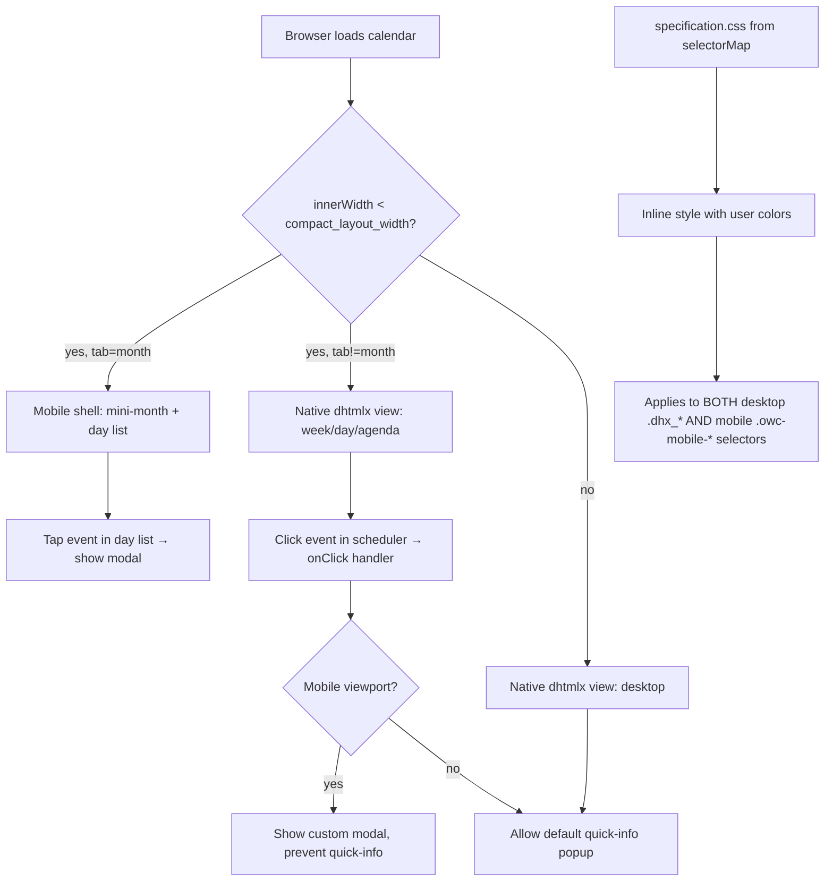

# Mobile Color Fix + All-Views Modal + CSS Consistency

> **Execution requirement:** Read and understand this entire plan before making any code changes. Any subagents listed in `## Execution: Subagent dispatch` below **must be executed** via `Task(...)` calls — do not substitute prose descriptions or skip subagent delegation steps.

## Problem Analysis (Root Causes)

### Color Issue — Confirmed via debug logs

The debug session (session `c9efc6`) confirmed:

1. **`generateCSS` from the theme extension never runs in the settings preview context** — the settings preview loads the calendar directly via URL without `calendar.js`.
2. **The `selectorMap` in `styleConfig.js` was updated** to include mobile selectors (`.owc-mobile-month-header`, `.owc-mobile-nav-button`, etc.), so `generateCssFromStyles()` now generates CSS rules targeting both desktop AND mobile elements. This CSS goes into `specification['css']` via the URL parameter.
3. **BUT lines 50-58 in dhtmlx.html override it** — The template renders `{{ specification['css'] }}` at line 49, then hardcoded mobile token rules at lines 50-58. Since lines 50-58 come LATER in the cascade with identical specificity, they override the selectorMap-generated rules with CSS variable defaults (`var(--dhx-scheduler-container-background)`, etc.), which remain at dhtmlx theme defaults (blue/teal).

**Fix**: Remove lines 50-58 from dhtmlx.html. The `selectorMap` changes already handle generating mobile-targeted CSS with user colors. The `mobile-view.css` linked stylesheet provides CSS variable fallback defaults (loaded before the inline `<style>`, so lower cascade priority).

### Tab/View Issue

The debug session confirmed `specification.tab` values ("week", "day", "agenda") correctly reach `_render()`. A fix was applied during debugging: `useMobileShell = mobile && currentTab === "month"`. Non-month views render using the native dhtmlx scheduler.

**Remaining gap**: The event modal currently only works inside the month mobile shell. For week/day/agenda views on mobile, the dhtmlx quick-info popup still shows. The user wants the custom modal on ALL views when on mobile.

### Modal Accessibility Issue

The `.owc-mobile-event-modal` div lives inside `#owc-mobile-shell`. When the shell is hidden (non-month views), the modal is inaccessible (`display: none` on parent). Additionally, the click/keydown handlers for the modal are attached to `root` (`#owc-mobile-shell`), so events from the modal — once moved outside the shell — would no longer bubble to `root`. Both the DOM position and the event bindings must be updated.

## Architecture Overview



Key design points:
- **Single color pipeline**: `generateCssFromStyles()` in the React app produces CSS rules that target both desktop (`dhx_*`) and mobile (`owc-mobile-*`) selectors via `selectorMap`. This CSS travels in the URL → becomes `specification['css']` → renders in the inline `<style>`. No separate theming path needed for mobile.
- **Modal is view-agnostic**: The event modal lives outside `#owc-mobile-shell` as a direct child of `<body>`. It's usable by the month shell's internal click handler AND by the scheduler's `onClick` event handler for non-month views.
- **Mobile detection is consistent**: Both the mobile shell activation and the onClick interception use the same `_isMobile(specification)` check based on `compact_layout_width`.
- **Event handler separation**: Modal close/backdrop/Escape handlers are bound to the modal element itself (not to `#owc-mobile-shell`), so they work regardless of the shell's visibility state.

## Data Flow (Color Pipeline)

1. User picks colors in `CalendarSettingsForm.jsx` → `stylesInput` object updates.
2. `generateCssFromStyles(stylesInput)` iterates each key-value pair and calls `generateCss(key, value)`.
3. For each key (e.g. `header_background`), `generateCss` finds the config in `styleConfig`, looks up `selectorMap[key]` (which now includes mobile selectors like `.owc-mobile-month-header`), and generates a rule like:
   `.dhx_cal_navline, .owc-mobile-month-header { /*start header_background*/ background-color: rgba(217,217,217,1);/*end header_background*/ }`
4. This CSS string becomes `formInput.css`, which is encoded into the calendar URL.
5. Flask renders the URL's `css` value into `{{ specification['css'] }}` inside the inline `<style>` block of dhtmlx.html.
6. The inline `<style>` has higher cascade priority than the linked `mobile-view.css` (which provides CSS variable fallback defaults). The user's colors override the defaults.
7. In the theme extension context, `calendar.js` also runs `generateCSS()` (with `g` flag) on the same inline `<style>`, replacing all tokens with block settings values.

## Files to Modify

- **[open_web_calendar/static/js/mobile-view.js](open_web_calendar/static/js/mobile-view.js)** —
  1. Remove all 3 debug `fetch()` regions (`// #region agent log` → `// #endregion` at lines ~483-485, ~671-673, ~729-731).
  2. Change modal lookups in `init()` (lines ~693-698) from `root.querySelector(...)` to `document.querySelector(...)` for all 6 modal elements.
  3. Replace the `insertBefore` logic (lines ~703-709): since the modal is no longer a child of `root`, always use `root.appendChild(calendarContainer)`. Remove the `if (modalRoot)` branch that calls `root.insertBefore(calendarContainer, modalRoot)`.
  4. Refactor `_attachClickHandlers(root)` so modal-specific handlers are bound to the modal element rather than `root`:
     - The **click handler for modal close/backdrop** (lines 588-595) must be bound to `state.modal.root` (the `.owc-mobile-event-modal` div), not to `root`. The rest of the click handler (action delegation for `[data-owc-action]` elements) stays on `root`.
     - The **keydown handler** (Escape and Tab/focus-trap) must also be bound to `document` or the modal element, since the modal is outside the shell. Binding to `document` is cleanest since focus-trap logic needs to capture Tab regardless of where focus is.
     - Track these handlers separately: `state.listeners.modalClick`, `state.listeners.keydown` (on document), `state.listeners.click` (on root, for action delegation only).
  5. Add `onClickId: null` to `state.listeners` object (line 30-34).
  6. In `init()`, after `_observeViewport(scheduler, specification)` (line ~727) and before `_render()` (line ~728), attach the scheduler onClick handler:
     ```js
     if (state.listeners.onClickId) {
       scheduler.detachEvent(state.listeners.onClickId);
     }
     state.listeners.onClickId = scheduler.attachEvent("onClick", function(id) {
       if (!_isMobile(state.specification)) return true;
       var event = scheduler.getEvent(id);
       if (event) {
         _showEventModal(event, state.scheduler, state.specification);
       }
       return false;
     });
     ```
  7. In `destroy()`, detach the onClick handler:
     ```js
     if (state.listeners.onClickId && state.scheduler) {
       state.scheduler.detachEvent(state.listeners.onClickId);
     }
     ```
     Null it: `state.listeners.onClickId = null;`
     Also update listener cleanup to remove `state.listeners.modalClick` from `state.modal.root` and `state.listeners.keydown` from `document`.

- **[open_web_calendar/static/js/configure.js](open_web_calendar/static/js/configure.js)** —
  1. Remove 2 debug `fetch()` regions (`// #region agent log` → `// #endregion` at lines ~454-456 and ~625-627).

- **[open_web_calendar/templates/calendars/dhtmlx.html](open_web_calendar/templates/calendars/dhtmlx.html)** —
  1. Remove the 9 hardcoded mobile CSS token rules between `{{ specification['css'] }}` and `</style>` (lines 50-58). These rules target `.owc-mobile-month-header`, `.owc-mobile-day-cell`, `.owc-mobile-day-cell.is-today`, `.owc-mobile-day-cell::after`, `.owc-mobile-day-list-item`, `.owc-mobile-modal-card`, `.owc-mobile-modal-card a`, `.owc-mobile-modal-card a:hover`, `.owc-mobile-modal-close`.
  2. Move `.owc-mobile-event-modal` div and all its children out of `#owc-mobile-shell`. The modal becomes a direct child of `<body>`, placed between `#owc-mobile-shell` and `#loader`. The shell becomes an empty div: `<div id="owc-mobile-shell" aria-hidden="true"></div>`.

## Files Already Modified (no further changes needed)

- **[Calendar-App/web/frontend/utils/styleConfig.js](c:\Users\cjswa\Documents\jadepuma\apps\Calendar-App\web\frontend\utils\styleConfig.js)** — Already updated with mobile selectors in `selectorMap` during the debug session. Verified correct.
- **[Calendar-App/extensions/calendar-theme-extension/assets/generateCss.js](c:\Users\cjswa\Documents\jadepuma\apps\Calendar-App\extensions\calendar-theme-extension\assets\generateCss.js)** — Already has `g` flag on all regex.
- **[open_web_calendar/static/css/dhtmlx/mobile-view.css](open_web_calendar/static/css/dhtmlx/mobile-view.css)** — No changes needed. CSS variable defaults act as fallbacks.
- **[open_web_calendar/static/css/dhtmlx/style.css](open_web_calendar/static/css/dhtmlx/style.css)** — No changes needed. `body:not(.owc-mobile-active)` scoping and hide rules are correct.

## Key Design Decisions

- **Why remove lines 50-58 instead of reordering**: The selectorMap changes make these rules fully redundant. The `specification['css']` already contains mobile selectors with user-chosen colors. Removing them eliminates the cascade conflict with zero risk.
- **Why move the modal out of the shell**: The modal must be accessible for ALL views. When the shell is hidden (non-month views), a modal inside it can't display. Moving it to `<body>`-level makes it universally available. All modal CSS uses class-based selectors (not descendant selectors), so styles apply regardless of DOM position.
- **Why bind modal handlers to the modal element**: The plan-reviewer identified that click/keydown handlers on `root` (`#owc-mobile-shell`) won't catch events from the modal once it's moved outside. Binding close/backdrop handlers directly to the modal element and keydown handler to `document` ensures they work regardless of the shell's state.
- **Why replace insertBefore with appendChild**: The current `root.insertBefore(calendarContainer, modalRoot)` inserts the calendar container before the modal inside the shell. Once the modal is removed from the shell, `modalRoot` is no longer a child of `root`, and `insertBefore` would throw `NotFoundError`. Since the shell is now empty, `appendChild` is the correct method.
- **Why intercept via scheduler onClick**: The dhtmlx `onClick` event fires when users click/tap on an event. Returning `false` prevents the default quick-info popup from showing. This works for ALL scheduler views (week, day, agenda) uniformly.

## Caveats / Things to Verify

- **CSS specificity between mobile-view.css and inline style**: The linked `mobile-view.css` loads before the inline `<style>` in the document head. Same-specificity rules in the inline `<style>` (from `specification['css']`) override those in `mobile-view.css`. Confirm via computed styles after the fix.
- **onClick handler ordering**: Our handler is attached in `OwcMobileView.init()` (which runs on first `onXLE`). If the quick-info plugin registers its own internal handlers earlier, our returning `false` should still prevent the popup since dhtmlx's event system respects `false` returns.
- **Tooltip on non-touch devices at mobile width**: `IS_TOUCH_SCREEN` disables tooltips on touch devices. On non-touch narrow screens, tooltips would still be enabled. The onClick handler's `return false` also prevents tooltip display in these cases.
- **scheduler.detachEvent**: The onClick handler ID must be stored and detached in `destroy()` to prevent leaks.
- **Hardcoded rgba in mobile-view.css**: The modal backdrop uses `rgba(0, 0, 0, 0.45)`, which is intentional for the semi-transparent overlay effect. This is not a user-configurable color and should NOT use a CSS variable.

## Execution: Subagent dispatch

### Phase 1 — Clean up debug instrumentation (serial)

<!-- plan-execution: verbatim-prompt -->
```
Task(
  subagent_type="executor",
  description="Remove debug instrumentation from JS files",
  prompt="Remove ALL debug fetch() instrumentation from TWO files. Each debug log is wrapped in '// #region agent log' and '// #endregion' comments. Remove the entire region (both comment markers AND the fetch/code line(s) between them). Do NOT leave blank lines in place of the removed code.\n\n1. c:\\Users\\cjswa\\Documents\\jadepuma\\apps\\open-web-calendar\\open_web_calendar\\static\\js\\mobile-view.js — There are THREE debug regions at approximately:\n   - Line 483-485 (inside _render function)\n   - Line 671-673 (start of init function)\n   - Line 729-731 (end of init function, after _render call)\n\n2. c:\\Users\\cjswa\\Documents\\jadepuma\\apps\\open-web-calendar\\open_web_calendar\\static\\js\\configure.js — There are TWO debug regions at approximately:\n   - Line 454-456 (before scheduler.init call)\n   - Line 625-627 (inside onXLE handler)\n\nAfter editing, search each file for '127.0.0.1:7504' and 'c9efc6' to confirm zero matches remain. Do NOT change any other code. Return when both files are saved and confirmed clean."
)
```

### Phase 2 — Fix color cascade + relocate modal in template (serial, depends on Phase 1)

<!-- plan-execution: verbatim-prompt -->
```
Task(
  subagent_type="executor",
  description="Fix color cascade and move modal in dhtmlx.html",
  prompt="Edit c:\\Users\\cjswa\\Documents\\jadepuma\\apps\\open-web-calendar\\open_web_calendar\\templates\\calendars\\dhtmlx.html. TWO changes:\n\n1. REMOVE the hardcoded mobile CSS token rules inside the inline <style> block that appear AFTER the line '{{ specification[\"css\"] }}'. These are 9 CSS rules starting with '.owc-mobile-month-header {' and ending with '.owc-mobile-modal-close {'. They contain comment tokens like '/*start header_background*/', '/*start date_grid_text*/', '/*start event_dot*/', '/*start event_background*/', '/*start modal_background*/', '/*start modal_links_text*/', '/*start modal_links_hover*/', '/*start modal_close_button*/'. Remove ALL 9 of these rule lines. After removal, the <style> block should end with:\n            {{ specification['css'] }}\n        </style>\n\n2. RESTRUCTURE the body HTML. Currently it has:\n<div id=\"owc-mobile-shell\" aria-hidden=\"true\"><div class=\"owc-mobile-event-modal\" role=\"dialog\" aria-modal=\"true\" style=\"display:none;\"><div class=\"owc-mobile-modal-backdrop\"></div><div class=\"owc-mobile-modal-card\"><button class=\"owc-mobile-modal-close\" aria-label=\"Close\">&times;</button><div class=\"owc-mobile-modal-title\"></div><div class=\"owc-mobile-modal-date\"></div><div class=\"owc-mobile-modal-content\"></div><div class=\"owc-mobile-modal-link\"></div></div></div></div>\n\nChange it to TWO sibling divs:\n        <div id=\"owc-mobile-shell\" aria-hidden=\"true\"></div>\n        <div class=\"owc-mobile-event-modal\" role=\"dialog\" aria-modal=\"true\" style=\"display:none;\">\n            <div class=\"owc-mobile-modal-backdrop\"></div>\n            <div class=\"owc-mobile-modal-card\">\n                <button class=\"owc-mobile-modal-close\" aria-label=\"Close\">&times;</button>\n                <div class=\"owc-mobile-modal-title\"></div>\n                <div class=\"owc-mobile-modal-date\"></div>\n                <div class=\"owc-mobile-modal-content\"></div>\n                <div class=\"owc-mobile-modal-link\"></div>\n            </div>\n        </div>\n\nThe modal becomes a SIBLING of #owc-mobile-shell, placed between it and #loader. The shell is now an empty div. Do NOT change any other tags or attributes. Return when saved."
)
```

### Phase 3 — Update mobile-view.js behavior (serial, depends on Phase 2)

This is the most complex step. It must be done carefully because multiple interdependent code sections change.

<!-- plan-execution: verbatim-prompt -->
```
Task(
  subagent_type="executor",
  description="Update modal refs, handlers, and add onClick in mobile-view.js",
  prompt="Edit c:\\Users\\cjswa\\Documents\\jadepuma\\apps\\open-web-calendar\\open_web_calendar\\static\\js\\mobile-view.js. FIVE changes — read ALL before starting:\n\nCHANGE 1 — Add onClickId and modalClick to state.listeners:\nFind the listeners object inside the state declaration (around line 30-34):\n    listeners: {\n      click: null,\n      keydown: null,\n      resize: null,\n    },\nChange it to:\n    listeners: {\n      click: null,\n      modalClick: null,\n      keydown: null,\n      resize: null,\n      onClickId: null,\n    },\n\nCHANGE 2 — Update modal lookups in init() to use document.querySelector:\nFind these 6 lines in the init function (around line 693-698, exact line numbers may shift after debug removal):\n    const modalRoot = root.querySelector('.owc-mobile-event-modal');\n    const modalClose = root.querySelector('.owc-mobile-modal-close');\n    const modalTitle = root.querySelector('.owc-mobile-modal-title');\n    const modalDate = root.querySelector('.owc-mobile-modal-date');\n    const modalContent = root.querySelector('.owc-mobile-modal-content');\n    const modalLink = root.querySelector('.owc-mobile-modal-link');\nChange ALL SIX from root.querySelector to document.querySelector.\n\nCHANGE 3 — Replace insertBefore with appendChild:\nFind this block in init() (around line 703-709):\n    if (modalRoot) {\n      modalRoot.removeAttribute('style');\n      root.insertBefore(calendarContainer, modalRoot);\n      modalRoot.setAttribute('aria-hidden', 'true');\n    } else {\n      root.appendChild(calendarContainer);\n    }\nReplace the ENTIRE block with:\n    root.appendChild(calendarContainer);\n    if (modalRoot) {\n      modalRoot.removeAttribute('style');\n    }\n\nCHANGE 4 — Refactor _attachClickHandlers to separate shell and modal handlers:\nReplace the ENTIRE _attachClickHandlers function (currently around lines 580-639). The current function binds both modal close and action delegation handlers to root. Replace with:\n\n  function _attachClickHandlers(root) {\n    if (state.listeners.click) {\n      root.removeEventListener('click', state.listeners.click);\n    }\n    if (state.listeners.modalClick && state.modal.root) {\n      state.modal.root.removeEventListener('click', state.listeners.modalClick);\n    }\n    if (state.listeners.keydown) {\n      document.removeEventListener('keydown', state.listeners.keydown);\n    }\n\n    // Modal close/backdrop handler — bound to the modal element\n    state.listeners.modalClick = function onModalClick(event) {\n      const closeTarget = event.target.closest(\n        '.owc-mobile-modal-close, .owc-mobile-modal-backdrop'\n      );\n      if (closeTarget) {\n        _hideEventModal();\n      }\n    };\n\n    // Shell action delegation — bound to #owc-mobile-shell\n    state.listeners.click = function onRootClick(event) {\n      const actionElement = event.target.closest('[data-owc-action]');\n      if (!actionElement || !root.contains(actionElement)) {\n        return;\n      }\n      _handleAction(actionElement);\n    };\n\n    // Keyboard handler for modal — bound to document\n    state.listeners.keydown = function onDocumentKeyDown(event) {\n      if (!state.modal.root || !state.modal.root.classList.contains(MOBILE_MODAL_OPEN_CLASS)) {\n        return;\n      }\n\n      if (event.key === 'Escape') {\n        event.preventDefault();\n        _hideEventModal();\n        return;\n      }\n\n      if (event.key !== 'Tab') {\n        return;\n      }\n\n      const focusable = _getFocusableElements(state.modal.root);\n      if (!focusable.length) {\n        event.preventDefault();\n        return;\n      }\n\n      const first = focusable[0];\n      const last = focusable[focusable.length - 1];\n      const current = document.activeElement;\n\n      if (event.shiftKey && current === first) {\n        event.preventDefault();\n        last.focus();\n      } else if (!event.shiftKey && current === last) {\n        event.preventDefault();\n        first.focus();\n      }\n    };\n\n    root.addEventListener('click', state.listeners.click);\n    if (state.modal.root) {\n      state.modal.root.addEventListener('click', state.listeners.modalClick);\n    }\n    document.addEventListener('keydown', state.listeners.keydown);\n  }\n\nCHANGE 5 — Add scheduler onClick handler in init() and update destroy():\n\n5a. In init(), find the line '_observeViewport(scheduler, specification);' and the line '_render();' that follows it. BETWEEN these two lines, add:\n    if (state.listeners.onClickId) {\n      scheduler.detachEvent(state.listeners.onClickId);\n    }\n    state.listeners.onClickId = scheduler.attachEvent('onClick', function(id) {\n      if (!_isMobile(state.specification)) return true;\n      const event = scheduler.getEvent(id);\n      if (event) {\n        _showEventModal(event, state.scheduler, state.specification);\n      }\n      return false;\n    });\n\n5b. In destroy(), find the block that removes event listeners (around line 754-763 before debug removal, exact lines may have shifted). AFTER the line that removes orientationchange listener and BEFORE '_hideEventModal();', add:\n    if (state.listeners.onClickId && state.scheduler) {\n      state.scheduler.detachEvent(state.listeners.onClickId);\n    }\n\nAlso in destroy(), update the handler cleanup to match the new handler structure. The current cleanup block is:\n    if (state.root && state.listeners.click) {\n      state.root.removeEventListener('click', state.listeners.click);\n    }\n    if (state.root && state.listeners.keydown) {\n      state.root.removeEventListener('keydown', state.listeners.keydown);\n    }\nReplace it with:\n    if (state.root && state.listeners.click) {\n      state.root.removeEventListener('click', state.listeners.click);\n    }\n    if (state.modal.root && state.listeners.modalClick) {\n      state.modal.root.removeEventListener('click', state.listeners.modalClick);\n    }\n    if (state.listeners.keydown) {\n      document.removeEventListener('keydown', state.listeners.keydown);\n    }\n\nAnd in the null-out block at the end of destroy(), add:\n    state.listeners.modalClick = null;\n    state.listeners.onClickId = null;\n\nReturn when saved. Verify the file has no syntax errors by checking that all braces balance."
)
```

### Phase 4 — Run existing tests (serial, depends on Phase 3)

<!-- plan-execution: verbatim-prompt -->
```
Task(
  subagent_type="test-runner",
  description="Run behave and pytest suites for regressions",
  prompt="In c:\\Users\\cjswa\\Documents\\jadepuma\\apps\\open-web-calendar: Run existing test suites to check for regressions after the mobile-view.js refactoring.\n\n1. Run `python -m behave open_web_calendar/features/mobile-view.feature` if the feature file exists. Capture output.\n2. Run `python -m pytest open_web_calendar/test` if a tests/ or test/ folder exists. Capture output.\n3. If any tests fail, report the failure details including tracebacks. Do NOT mask failures.\n4. If the test infrastructure itself fails (e.g. missing dependencies, server startup issues), report that separately from test failures.\n\nReturn a structured report: pass/fail per scenario/test, any error tracebacks, and whether the changes likely caused the failures or if they are pre-existing infrastructure issues."
)
```

### Phase 5 — Verification (serial, depends on all prior phases)

<!-- plan-execution: verbatim-prompt -->
```
Task(
  subagent_type="verifier",
  description="Verify color fix, all-views modal, and CSS consistency",
  prompt="Verify the implementation described in c:\\Users\\cjswa\\Documents\\jadepuma\\apps\\open-web-calendar\\.cursor\\plans\\mobile_color_and_allviews_fix_b4e72f1a.plan.md. Check TWO repos: c:\\Users\\cjswa\\Documents\\jadepuma\\apps\\open-web-calendar and c:\\Users\\cjswa\\Documents\\jadepuma\\apps\\Calendar-App.\n\nCHECKS:\n1. dhtmlx.html inline <style> does NOT contain any '.owc-mobile-*' CSS rules after '{{ specification[\"css\"] }}'. The only content between {{ specification['css'] }} and </style> should be whitespace. The 9 hardcoded mobile token rules must be GONE.\n2. dhtmlx.html <body> has .owc-mobile-event-modal as a SIBLING of #owc-mobile-shell (not nested inside it). The modal div should appear between #owc-mobile-shell and #loader. The shell div should be empty (no children in template).\n3. mobile-view.js init() uses document.querySelector (NOT root.querySelector) for all six modal element lookups (modalRoot, modalClose, modalTitle, modalDate, modalContent, modalLink).\n4. mobile-view.js init() uses root.appendChild(calendarContainer) — NOT root.insertBefore. There should be no insertBefore call in init().\n5. mobile-view.js _attachClickHandlers binds THREE separate handlers: (a) state.listeners.click on root for action delegation [data-owc-action], (b) state.listeners.modalClick on state.modal.root for close/backdrop, (c) state.listeners.keydown on document for Escape and focus-trap.\n6. mobile-view.js init() attaches scheduler.attachEvent('onClick', ...) that checks _isMobile() and shows the modal on mobile, returning false to prevent quick-info.\n7. mobile-view.js state.listeners object has 5 properties: click, modalClick, keydown, resize, onClickId.\n8. mobile-view.js destroy() detaches onClick via scheduler.detachEvent, removes modalClick from modal.root, removes keydown from document, and nulls out onClickId and modalClick.\n9. NO debug fetch() instrumentation remains in mobile-view.js or configure.js. Search for '127.0.0.1:7504', 'c9efc6', and '#region agent log' — there should be ZERO matches in both files.\n10. Calendar-App/web/frontend/utils/styleConfig.js selectorMap contains mobile selectors: .owc-mobile-month-header in header_background, .owc-mobile-nav-button in header_background, .owc-mobile-day-cell in date_grid_text, .owc-mobile-day-list-item in event_background and event_text, .owc-mobile-event-dot in event_dot, .owc-mobile-modal-card in modal_background and modal_text.\n11. The _render() function still uses useMobileShell = mobile && currentTab === 'month' (tab fix preserved).\n\nReturn APPROVE or list specific failures with file:line citations."
)
```

## Verification Checklist

- [ ] dhtmlx.html inline `<style>` has NO `.owc-mobile-*` rules after `{{ specification['css'] }}`
- [ ] `.owc-mobile-event-modal` is a sibling of `#owc-mobile-shell` in the body, not a child
- [ ] `mobile-view.js` uses `document.querySelector` for modal lookups
- [ ] `mobile-view.js` uses `root.appendChild` (no `insertBefore` in init)
- [ ] `mobile-view.js` binds modal close/backdrop handler to the modal element directly
- [ ] `mobile-view.js` binds keydown handler to `document` (not root)
- [ ] `mobile-view.js` attaches scheduler `onClick` handler to intercept event clicks on mobile
- [ ] `mobile-view.js` `destroy()` properly detaches all handlers including onClick
- [ ] No debug instrumentation remains in any file
- [ ] `styleConfig.js` `selectorMap` includes mobile selectors for all relevant keys
- [ ] On mobile month view: colors from settings apply to header, buttons, day cells, events, dots, modal
- [ ] On mobile week/day/agenda view: clicking an event shows the custom modal (not quick-info)
- [ ] On desktop: clicking an event shows the default quick-info popup (unchanged)
- [ ] CSS consistency: all views use the same color values from `specification['css']`
